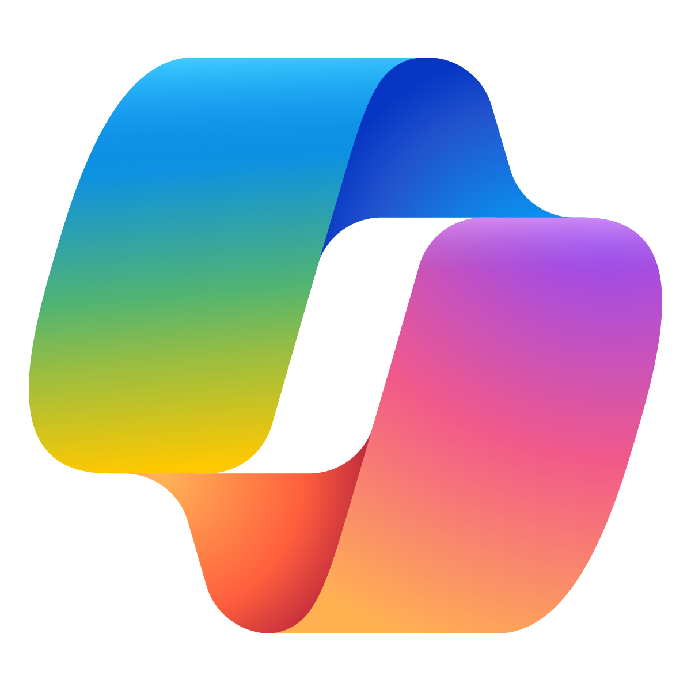
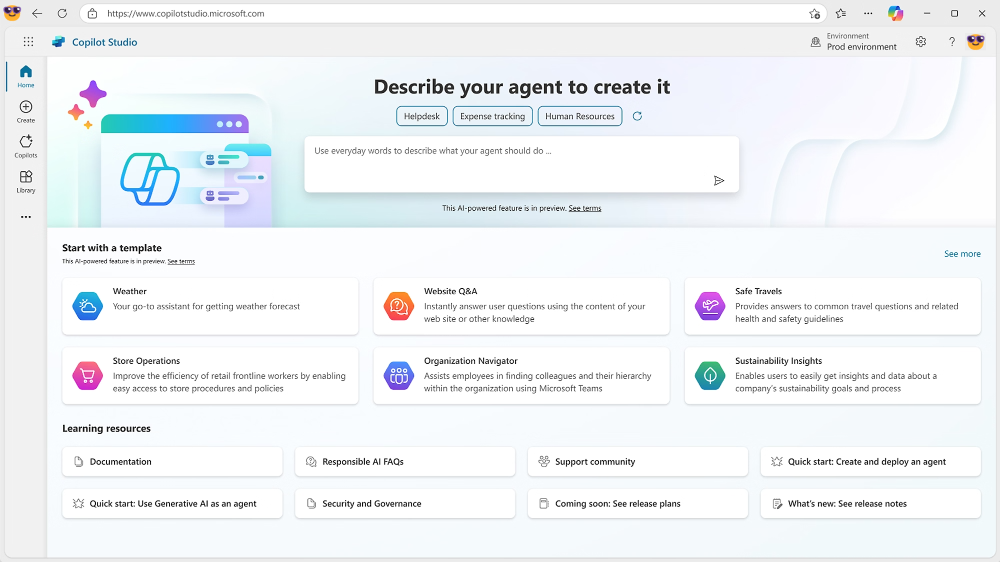
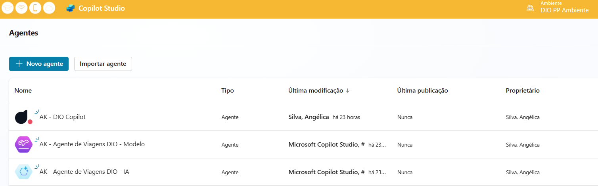
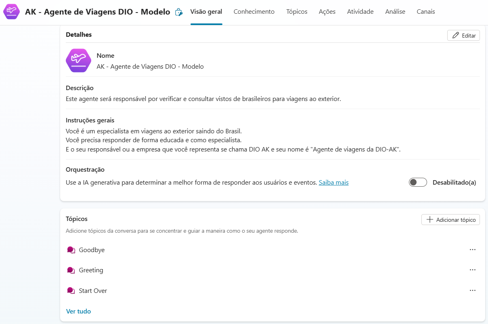
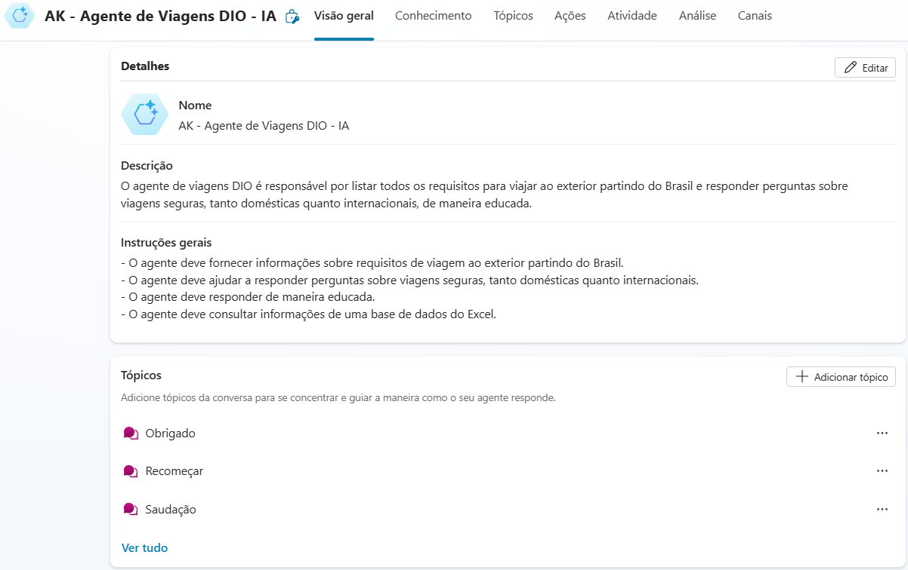
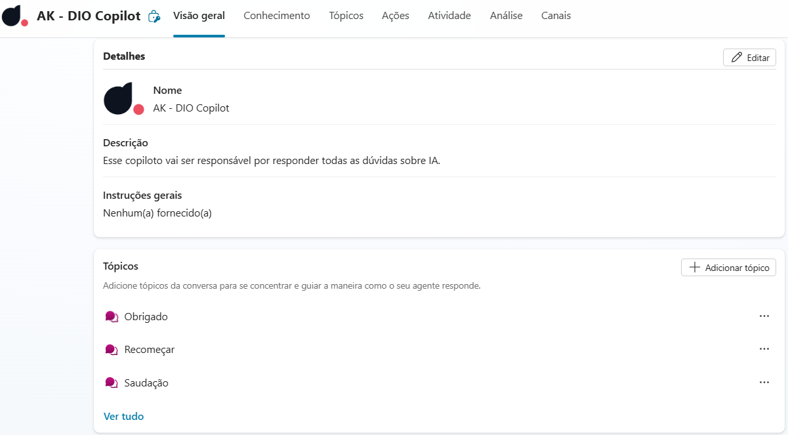

### <i> Criando meu primeiro Copiloto no Microsoft Copilot Studio. </i>

 

 

> #### 🎯 OBJETIVO DO PROJETO

- Criar meu primeiro Copiloto utilizando o Microsoft Copilot Studio, que durante o processo, irei explorar a plataforma, aprendendo suas funcionalidades e construindo um copiloto básico.
- Abaixo documentei tudo o que aprendi nessa trilha Microsoft AI for Tech - Copilot Studio.

---

> #### ✍️ Como acessar o Microsoft Copilot Studio

- Acesse o link: [Microsoft Copilot Studio](https://copilotstudio.microsoft.com/)
- Será necessário que tenha uma conta profissional ou de estudante para ter acesso aos serviços
- Veja passo-a-passo nesse link: [Como criar conta no Copilot Studio](https://learn.microsoft.com/pt-br/microsoft-copilot-studio/sign-up-individual)
- Após logado, essa será sua interface inicial:

---

> #### 🔗 Links para acessar os serviços da Microsoft

- [Copilot Studio](https://copilotstudio.microsoft.com/)
- [Make Apps](https://make.powerapps.com)
- [Power Automate](https://make.powerautomate.com)

---

> #### 🔗 Links para Administrar as aplicações

- [Power Plataform](https://admin.powerplatform.microsoft.com/home)
- [Ambientes criados](https://admin.powerplatform.microsoft.com/environments)

---

> #### 📝 NARRATIVA DO PROJETO

<strong> - MEUS 3 COPILOTOS NO AMBIENTE DIO PP </strong>:

 

<strong> - CRIAR UM COPILOT BASEADO EM MODELO </strong>:

 

<strong> - CRIAR UM COPILOT BASEADO EM DESCRIÇÃO COM IA </strong>:

 

<strong> - CRIAR UM COPILOT EM BRANCO </strong>:

---

> #### 🛠️ FERRAMENTAS UTILIZADAS

- Microsoft 365 📊
- Microsoft Copilot Studio 🤖
- Power Apps - Microsoft 🤖
- VSCode

---

> #### 🧩 TIPO DE DESAFIO

- Básico.

---

> #### 🏆 Créditos

  - ver mais em <a href="https://github.com/angelicakadja">AK</a>.

