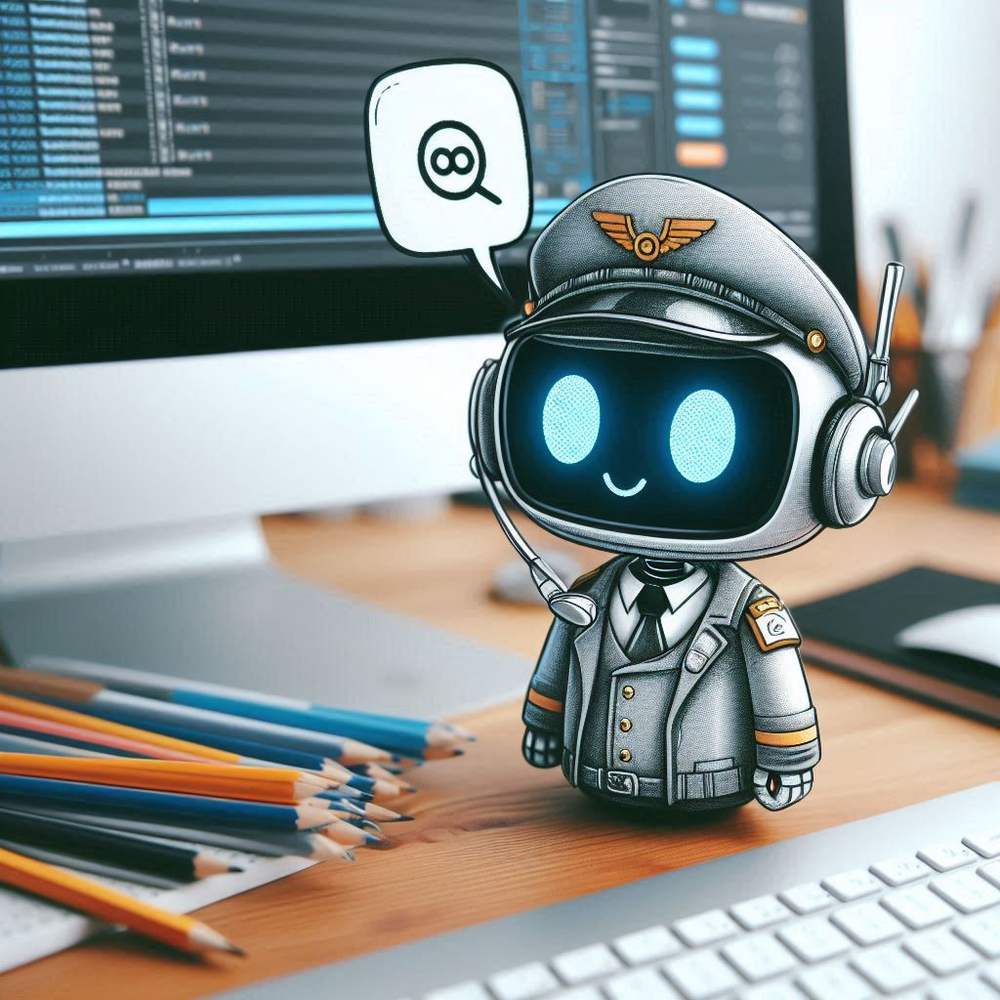
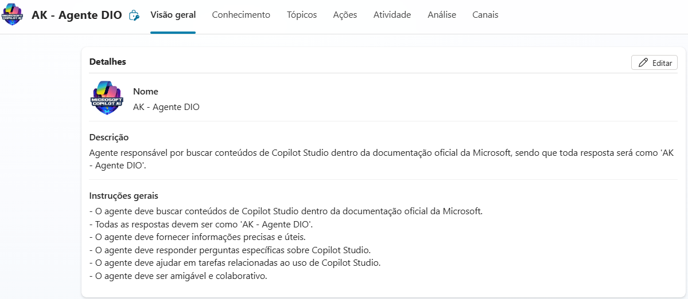
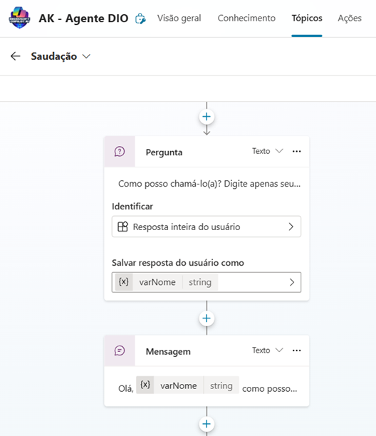
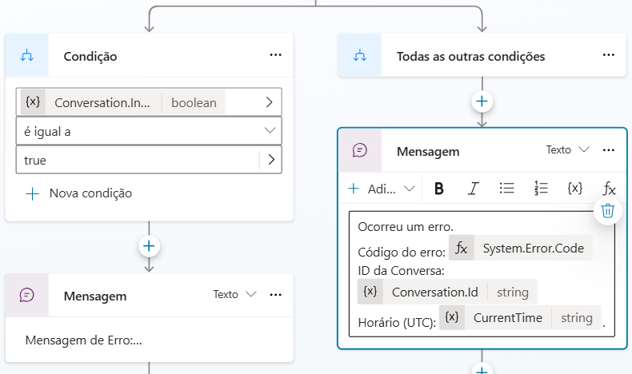
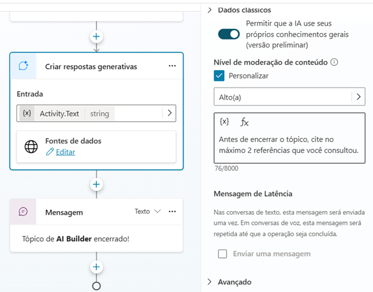
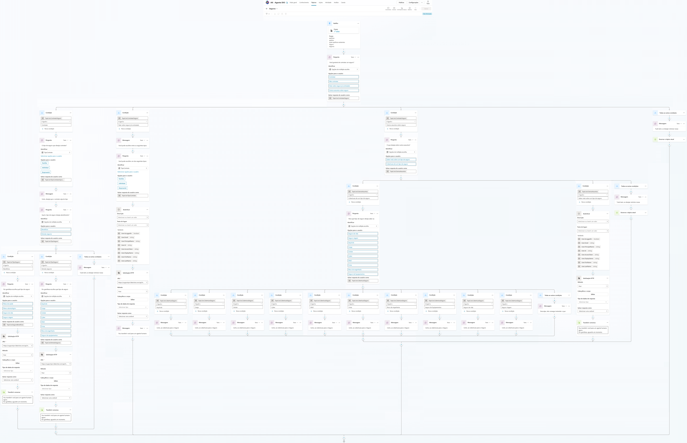

### <i> Fluxo de Conversa Personalizado para Controles de Seguros no Microsoft Copilot Studio. </i>

 

 

<b> Imagem criada através do <strong> Copilot </strong> nativo do Windows 11.</b>

> ####  Etapas do desafio

- Criar um copiloto em branco.
- Customizar um tópico.
- Personalizar uma mensagem de erro do tópico.
- Aumentar/diminuir a qualidade da resposta com GenAI.

---

### PASSO A PASSO DA CRIAÇÃO DO DESAFIO

> ####  Copiloto em branco construído e acrescentado ícone ao agente

 

---

> ####  Customizar um tópico

- Tópico saudação customizado para trazer o nome do usuário.

---

> ####  Personalizar uma mensagem de erro do tópico

---

> ####  Aumentar/diminuir a qualidade da resposta com GenAI

---

> ####  Resultado do desafio

> #### 🛠️ Ferramentas utilizadas

- Copilot nativo do Windows 11 🪟
- Microsoft Copilot Studio 🤖
- Power Apps - Microsoft 🤖
- VSCode 🛡️

---

> #### 🧩 Tipo de desafio

- Básico.

---

> #### 🏆 Créditos

  - ver mais em <a href="https://github.com/angelicakadja">AK</a>.

