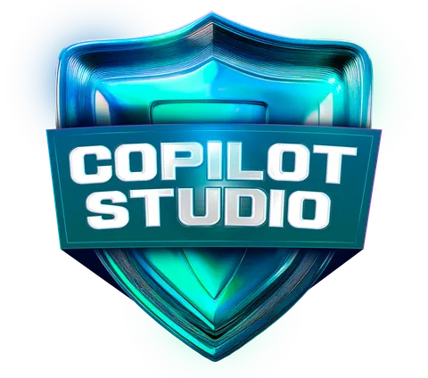

### <i> Bem-vindo (a) a minha trilha Microsoft AI for Tech - Copilot Studio. </i>

 

> #### 🎯 Principais Tópicos Abordados

- Fundamentos do Microsoft Copilot Studio
- Construindo Diálogos no Microsoft Copilot Studio
- Personalizando Respostas no Microsoft Copilot Studio
- Publicando Copilotos no Microsoft Copilot Studio

---

> #### ⚜️ Detalhe deste Bootcamp

- IA na ponta dos seus dedos!
- Desenvolver agentes e plugins de IA personalizados com o Microsoft Copilot Studio, criando chatbots inteligentes e automatizando interações de forma eficiente.
- Gerenciando eventos, integrando soluções com modelos pré-prontos e acelerando o desenvolvimento com uma abordagem low-code.
- Otimizando a escalabilidade das soluções e tornando a implementação de IA mais acessível, ágil e estratégica.

---

> #### 🛠️ FERRAMENTAS UTILIZADAS

- Microsoft Excel 365 📊
- Microsoft Copilot Studio 🤖
- Power Apps - Microsoft 🤖
- VSCode

---

> #### 🧩 TIPO DE DESAFIO

- Básico.

---

> #### 🏆 Créditos

  - ver mais em <a href="https://github.com/angelicakadja">AK</a>.

